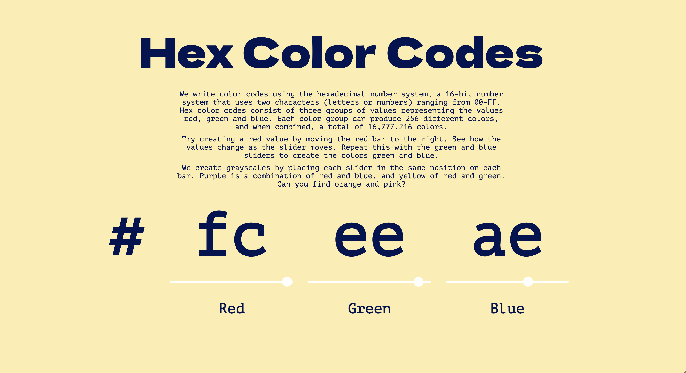

# Learn Hexadecimal Color Codes
This is a simple guide to learn how Hexadecimal numbers work together with RGB to create the hexadecimal color codes used in design.

## Contributing
If you'd like to contribute to this repository feel free to fork/submit a pull request, and if you have any suggestions feel free to email me at abbeyyacoe@gmail.com.

## License
The theme is available as open source under the terms of the MIT License.
